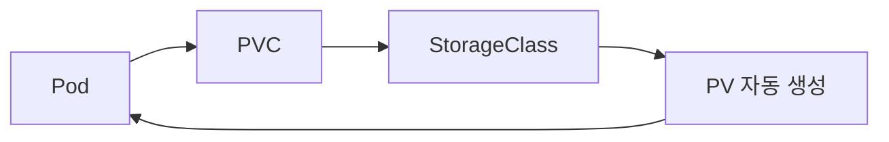

# StorageClass의 역할 (Kubernetes)

**StorageClass**는 Kubernetes에서  
👉 **스토리지를 “어떻게 자동으로 만들지” 정의하는 설정 객체**입니다.

즉, PVC(저장공간 요청서) → StorageClass(생성 방법 정의) → PV(실제 저장공간)

---

## 1️⃣ 왜 필요한가?

예전 방식:

- 관리자가 직접 PV(PersistentVolume)를 미리 만들어 둠
- 사용자는 그 PV를 수동으로 연결

지금 방식 (동적 프로비저닝):

- 사용자가 PVC(PersistentVolumeClaim)만 만들면
- StorageClass가 자동으로 PV를 생성

👉 운영이 훨씬 단순해짐

## [PV와 PVC란?](./pv-pvc.md)

## 2️⃣ StorageClass가 정의하는 것

StorageClass는 다음을 정의합니다:

| 항목              | 설명                          |
| ----------------- | ----------------------------- |
| provisioner       | 어떤 스토리지 드라이버를 쓸지 |
| reclaimPolicy     | PVC 삭제 시 PV 처리 방식      |
| volumeBindingMode | 언제 볼륨을 바인딩할지        |
| parameters        | 스토리지별 설정 옵션          |

---

## 3️⃣ 주요 필드 설명

### 🔹 provisioner

어떤 드라이버가 볼륨을 만들지 결정

예:

- `rancher.io/local-path` (k3s 기본)
- `kubernetes.io/aws-ebs`
- `pd.csi.storage.gke.io`

---

### 🔹 reclaimPolicy

PVC 삭제 시 PV 처리 방법

| 값     | 의미                        |
| ------ | --------------------------- |
| Delete | PVC 삭제하면 PV도 삭제      |
| Retain | PV는 남겨둠 (데이터 보호용) |

---

### 🔹 volumeBindingMode

| 값                   | 의미                     |
| -------------------- | ------------------------ |
| Immediate            | PVC 생성 즉시 PV 생성    |
| WaitForFirstConsumer | Pod가 스케줄링될 때 생성 |

`WaitForFirstConsumer`는  
노드 위치가 중요한 경우(Local storage 등)에 중요합니다.

---

## 4️⃣ 동작 흐름

#### storageClass를 사용하면 PV를 별도로 생성할 필요는 없음
